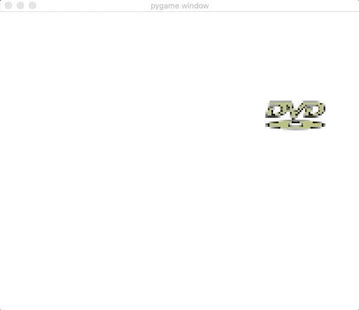
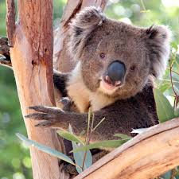
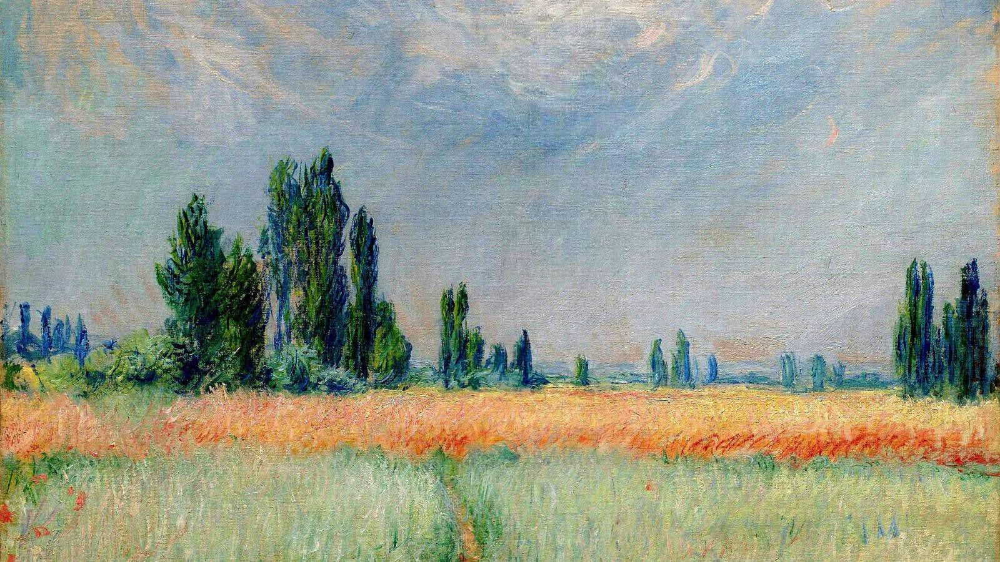
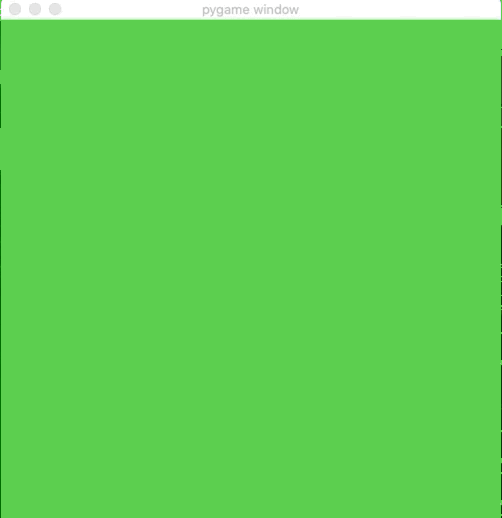
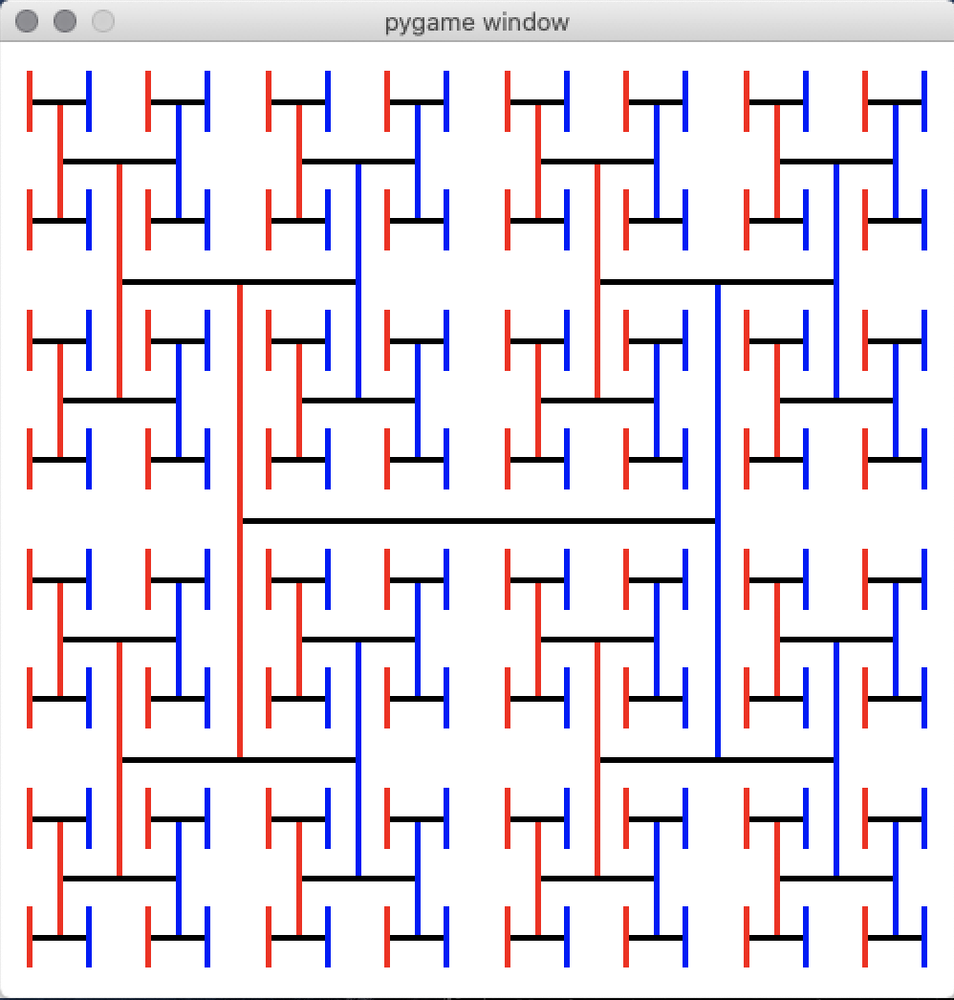
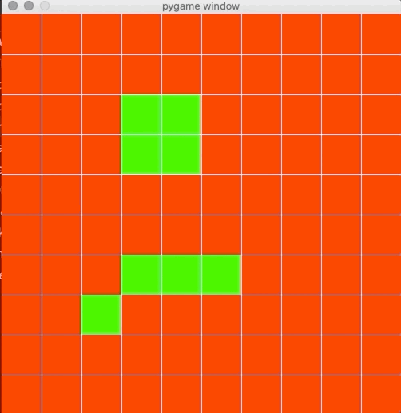
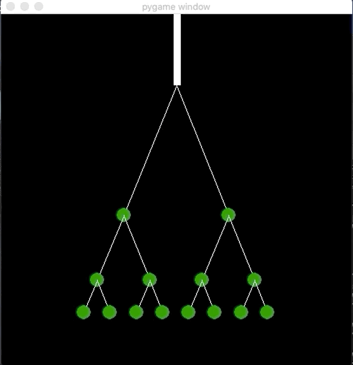

# Oversigt over hvad de forskellige visualiseringer gør og hvordan de ser ud :)

## DVD'en
DVD prøver at ligne DVD screensaveren, hvilket var lidt af en meme da jeg lavede den.

## KOALA
Koalaen var en eller anden web ting jeg fandt og prøvede at efterligne. Det tager utrolig lang tid før den overhovedet er tæt på at ligne, men ja herunder er selve programmet og så det billede det skal bevæge sig hen imod.

Og det billede det tilnærmer sig:

## Prikmaler
Prikmaleren så jeg vist først hos The Coding Train eller lignende. Men ja det prøver også at tilnærme sig et billede ved at male cirkler med den rigtige farve forskellige steder på vinduet. Hvor cirklerne bliver mindre og mindre.

Og det billede det tilnærmer sig:

## Øjnene
Øjnene var en anden webting jeg prøvede at efterligne. Man kan ikke se min mus, men der hvor man klikker spawner den et par øjne, hvor øjnene følger musen.

## Fraktal
Fraktalet er bare et af de mere simple fraktaler, men er en god måde at lære piraterne om rekursive funktioner.

## Game of life
Ja det her er vist den mest fejlslåede. Det skulle have været game of life, hvor man først sætter hvilke celler der skal være i live, men ja jeg fucker noget op i genereringen af de nye celler så det er ikke helt rigtigt.

## Træet
Ja, lidt mærkeligt, men et træ hvor man ændrer på vinklen ved at køre rund med musen. Ville egentlig have lavet et af de flottere træer, men det her var hvad jeg formåede at kreere.
