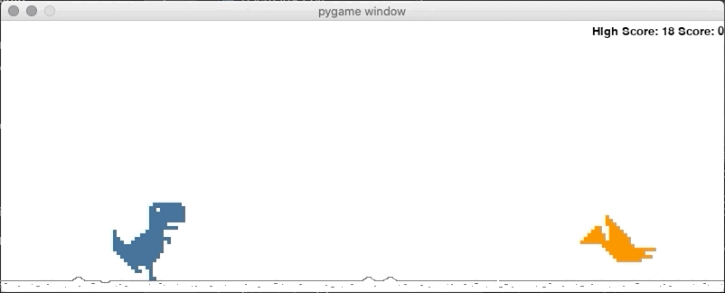

# Chromes dinospil i pygame

I dino mappen er der et .docx dokument som er en step by step gennemgang af hvordan spillet udvikles med kode og forklaringer.

Elev dino mappen er ment til at blive givet til eleverne, hvor alt det nødvendige ligger i.

Vi anvendte dette som et projekt, hvor vi lige havde lært dem om dictionaries, hvor vi tog dictionaries så langt de kunne tages. Med det efterfølgende projekt introducerede vi klasser, hvilket med dette projekt gjorde objektorienteret programmering til et attraktivt alternativ.

Her er en lille gif af spillet.

