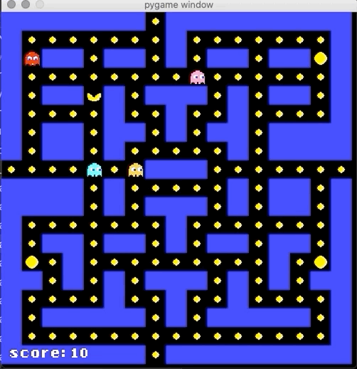

# Pacman i python

I pacman mappen er alt hvad der skal bruges til at lave spillet pacman. Der er en kodevejledning med step for step gennemgang af hele kodningen i en .docx, derudover er der også filer for hver af de enkelte trin underviseren kan kigge lidt på eller give til de elever som er røget lidt bagud eller lign.

Selve grid'et er ikke helt som originalen og sådan, men spøgelsernes bevægelse er så tæt på de kan komme.

Her er en gif fra step 21.

